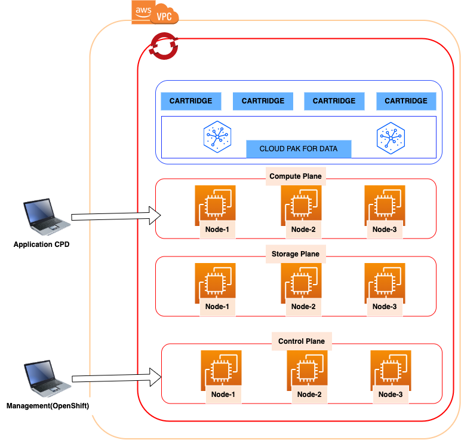

<AnchorLinks>
  <AnchorLink> Redhat Openshift on AWS (ROSA) </AnchorLink>
  <AnchorLink> Architecture Overview Diagram </AnchorLink>
  <AnchorLink> About Offering </AnchorLink>
  <AnchorLink> Offering Types</AnchorLink>
  <AnchorLink> Optional Services</AnchorLink>
  <AnchorLink>Acceleration Services</AnchorLink>

</AnchorLinks>

## Redhat Openshift on AWS (ROSA)
Red Hat OpenShift Service on AWS (ROSA) is a fully-managed OpenShift service, jointly managed and supported by both Red Hat and Amazon Web Services (AWS). Having your clusters maintained by this service gives you the freedom to focus on deploying applications.

## Architecture Overview Diagram

## About Offering
Through IBM Expert Labs Essential Management, IBM can help run and manage the day-to-day operations of IBM software using the proven practices of our experts. IBM can provide a stable, well-performing platform to support the Client’s applications, allowing the Client to focus on their business priorities.

The Cloud Service delivers Fully Managed offerings in which IBM will provide and manage the infrastructure (network, storage, and compute resources), apply fixes to the Software, and maintain the Software, infrastructure, and applicable security and privacy controls in support of Client’s Cloud Pak for Data production and/or non-production workload.

Client must have an associated software entitlement to IBM Cloud Pak for Data with
- Sufficient entitlements to cover installation and usage
- A current entitlement to Software and Support, as a prerequisite to this service.

IBM Cloud Pak for Data software entitlements use in this Cloud Service may not be use simultaneously in other environments.
The Cloud Service includes support for the Services or Cartridges which are part of IBM Cloud Pak for Data on Amazon Web Services (AWS) with Red Hat OpenShift infrastructure.
The detailed specifications, operational description, including environment sizing parameters and quantity of entitlements required to be purchased for given environment sizes, visit the [IBM Expert Labs Essential Management for IBM Cloud Pak for Data User Guide](https://www.ibm.com/support/pages/node/6541038)

These configurations may undergo revision from time to time.
## Offering Types
### Fully Managed on AWS Non-Prod
IBM will provide one environment that is not intended for Client Production use.
The environment includes:
- One cloud environment on a dedicated Virtual Private Cloud (VPC) single region, single availability zone cluster.
-	64 virtual central processing units (vCPUs), 4 worker nodes, 256GB memory, 1,200GB storage.
Additional services such as increased capacity and storage can be added to this environment via Section 1.2 Optional Services.

### Fully Managed on AWS Prod
IBM will provide one environment that is intended for Client Production use. The environment includes:
-	One cloud environment on a dedicated Virtual Private Cloud (VPC) single region, single availability zone cluster.
- Suitable for Production or pre-production workload.
-	64 virtual central processing units (vCPUs), 4 worker nodes, 256GB memory, 1,200GB storage.
-	High availability Red Hat OpenShift infrastructure configuration.
-	Daily backups.
-	Two(2) day Recovery Time Objective and one(1) day / 24 hours Recovery Point Objective.  

Additional services such as increased capacity and storage can be added to this environment via  Optional Services.

## Optional Services
The following optional services are offered as add-on services to an existing Cloud Service described above.

### Fully Managed Add Backup
Add-on backup services to one (1) existing Cloud Service environment.

### Fully Managed Add Multizone
- Multiple Availability Zone (Multi-AZ) support is an optional service for increased resiliency, availability, and physical redundancy.
- Add-on this service to one (1) existing Fully Managed on AWS Production environment.
- Multiple availability zone add-on services are required to be ordered during initial purchase as existing clusters cannot be changed after they have been deployed. Additionally they can only be deployed in regions with at least 3 availability zones.
- Compute nodes must be deployed in multiples of three (3) to maintain proper cluster balance. Clients may be required to purchase additional compute nodes to maintain this balance.

####	Fully Managed Add Node
Add-on one (1) additional compute node consisting of 16 virtual central processing units (vCPUs), 64GB memory, and 300GB storage to one (1) existing Cloud Service environment.
For clients with Multizone entitlement, the total number of nodes for the environment must be purchased and deployed in multiples of three (3).

### Fully Managed Add Storage
Add-on additional Gigabyte storage in increments of 300GB capacity to one (1) Cloud Service environment. Clients maybe be required to purchase additional storage when adding additional compute nodes to complete the environment’s configuration depending on which Service or Cartridge is being deployed.

## Acceleration Services
The Acceleration Services provide the Client with IBM Expert Labs Essential Management administration and advisor services to assist the Client in their day-to-day use of the Software.

The Client may select from the following available offerings.

### Admin
IBM will assign an Administrator to perform routine administrative tasks on a chosen cartridge or service (“Component”) of the Software (Client to confirm choice of Component prior to start of Cloud Service) during Prime Shift hours. The Administrator will be shared with other Clients. The number of other Clients will depend on the quantity of Admin services ordered. A quantity of one (1) will provide an Administrator shared with one (1) other client. A quantity of two (2) will allocate an Administrator fully dedicated to the Client.

The following tasks are examples of typical administrative services that may apply to selected Components of the Software. Actual tasks performed will depend on resource time allocated (quantity of parts purchased), the Software Component to be administered, the requirements of Client applications, and Client’s prioritization. At the time Client chooses the Component to be managed, IBM will provide specific information about the tasks to be performed that will apply to that Component and which will fit within the amount of resource allocated under the quantity of services purchased.

-	Respond to threshold alerts from Watson OpenScale and work with Client to examine the data science model for bias.
-	Retrain data science models as needed to mitigate model drift.
- Purge old data and log files, redistribute data, perform trend analysis on capacity utilization, and assist Client with forecasting future capacity needs.
-	Manage application-level user access and permissions.
-	Perform routine configuration changes to support changes to the application, expansion of capacity, addition of new user communities, and other evolution of the environment.
-	If applicable, configure connections to data science models and data sources.
-	Assist Client’s application developers with troubleshooting and resolving reported application problems.
-	Assist Client’s application developers with application performance tuning.

### Architect
IBM will assign an Architect to provide advisory services on a chosen Component of the Software (Client to confirm choice of Component prior to start of Service) during Prime Shift hours. The Architect will be shared with other Clients. The number of other Clients will depend on the quantity of Architect services ordered. A quantity of one (1) will provide an Architect shared with up to three (3) other clients, a quantity of two (2) will double this allocation, a quantity of three (3) will triple it, and a quantity of four (4) will allocate an Architect fully dedicated to the Client.
The following tasks are examples of typical advisory services that may apply to selected Components of the Software. Actual tasks performed will depend on resource time allocated (quantity of parts purchased), the Software Component chosen, the requirements of Client applications, and Client’s prioritization. At the time Client chooses the Component to be managed, IBM will provide specific information about the tasks to be performed that will apply to that Component and which will fit within the amount of resource allocated under the quantity of services purchased.

-	Identify and validate use cases, policies, and governance rules for Watson Knowledge Catalog.
-	Provide support and guidance for architecture and design.
-	Assist with the design and architecture of specific use cases or projects which are comprised of more complicated solutions.
-	Review out-of-the box requirements for the Software.
-	Work with Client to establish standards and guidelines for use of the Component
-	Work with Client to develop and deliver solution-specific use cases that Client has identified.
-	Assist Client with designing architecture of a multi-cloud implementation that takes into consideration location of data assets, performance impact of network latency, and long-term platform strategy.
-	Assist Client with developing a modernization strategy to rearchitect legacy applications for new platforms and new technology capabilities.

### Data Engineer
IBM will assign a Data Engineer to curate data assets during Prime Shift hours. The Data Engineer will be shared with other Clients. The number of other Clients will depend on the quantity of Data Engineer services ordered. A quantity of one (1) will provide a Data Engineer shared with up to three (3) other clients, a quantity of two (2) will double this allocation, a quantity of three (3) will triple it, and a quantity of four (4) will allocate a Data Engineer fully dedicated to the Client.
The following tasks are typical of the Data Engineer role that would be considered within the scope of this Acceleration Service. Actual tasks performed may include a subset of these, depending on resource time allocated under the quantity of services purchased, the requirements of Client applications, and Client’s prioritization.
- Add and maintain connections to data assets.
- Create and maintain virtualized views of data.
- Respond to data requests from Data Scientists and Business Analysts.
- Assist Data Stewards in analyzing and classifying assets.

### Data Scientist
IBM will assign a Data Scientist to provide advisory services during Prime Shift hours. The Data Scientist will be shared with other Clients. The number of other Clients will depend on the quantity of Data Scientist services ordered. A quantity of one (1) will provide a Data Scientist shared with up to three (3) other clients, a quantity of two (2) will double this allocation, a quantity of three (3) will triple it, and a quantity of four (4) will allocate a Data Scientist fully dedicated to the Client.
The following tasks are examples of typical advisory services that would be considered within the scope of this Acceleration Service. Actual tasks performed may include a subset of these, depending on resource time allocated under the quantity of services purchased, the requirements of Client applications, and Client’s prioritization.
-	Work with Client’s data scientists to assess planned data science use cases and offer input into options for creating models.
-	Assist with problem-solving if questions arise using IBM’s data science and machine learning technologies.
-	Participate in projects to develop new data science models. This may include providing recommendations and assisting with writing part of the code.
-	As prioritized by Client, participate in calls with users to discuss the content of models and answer questions about how the analysis in the model works.
-	Build assets for supporting users in their use of data models such as starter packs, guides, web conferences, documentation to assist the end user support team and addressing user questions, and other data science collateral related to the models.
-	Assist with the deployment of new and updated models through publishing the user support assets, hosting training webinars, and assisting with questions escalated by Client’s end user support team.
-	Create customized modifications to existing models to address the requirements of specific use cases and provide support to Client’s data scientists on creating their own modifications.
-	Host data science office hours conference calls with mutually agreed frequency to allow users to ask questions about Client’s data science models, what they do, how to use them, and how the analysis works.

### Data Steward
IBM will assign a Data Steward to manage Client’s data catalog and administer Client’s governance settings during Prime Shift hours. The Data Steward will be shared with other Clients. The number of other Clients will depend on the quantity of Data Steward services ordered. A quantity of one (1) will provide a Data Steward shared with up to three (3) other clients, a quantity of two (2) will double this allocation, a quantity of three (3) will triple it, and a quantity of four (4) will allocate a Data Steward fully dedicated to the Client.
The following tasks are examples of typical data catalog maintenance that would be considered within the scope of this Acceleration Service. Actual tasks performed may include a subset of these, depending on resource time allocated under the quantity of services purchased, the requirements of Client applications, and Client’s prioritization.
-	Associate classifications, data classes, business terms, and governance rules with data assets to help catalog users understand the available data.
-	Configure policies and data protection rules as directed by Client that deny access or mask data values in data assets.
-	Assign classifications, data classes, and business terms to data assets within a catalog.

### Database Admin
IBM will assign a Database Administrator (DBA) for either DB2, Informix, or Netezza (Client to confirm choice prior to start of Service) to perform routine database administration during Prime Shift hours. The DBA will be shared with other Clients. The number of other Clients will depend on the quantity of Database Admin services ordered. A quantity of one (1) will provide a DBA shared with up to three (3) other clients, a quantity of two (2) will double this allocation, a quantity of three (3) will triple it, and a quantity of four (4) will allocate a DBA fully dedicated to the Client.
The following tasks are examples of typical DBA activities that would be considered within the scope of this Acceleration Service. Actual tasks performed may include a subset of these, depending on resource time allocated under the quantity of services purchased, the requirements of Client applications, and Client’s prioritization.
- Maintain the databases and create/maintain their related objects (views, tables, etc.) as requested by Client’s application development team.
-	Proactively assess health of the databases monthly or as applicable and collaborate as needed with Client to plan and implement remediation when issues are found.
- Review the query statistics / performance logs generated by the databases with Client as needed and offer recommendations on steps to follow in addressing concerns with queries.
- Perform proactive operational database maintenance for purposes of capacity, stability, and performance. Specific details will vary according the database technology, but examples may include grooming tables, purging obsolete data, redistributing data, rebuilding indexes, and workload management.
- Review performance outputs or equivalent data collection for any performance bottlenecks, assist with resolution of these issues through analysis and engagement of development resources.
- Other standard database administration tasks of a routine operational or maintenance nature not specified above, as mutually agreed by both parties.

### Technical Account Manager
IBM will assign a Subject Matter Expert (SME) on the Software to act as the Technical Account Manager (TAM) providing coaching, mentoring and knowledge transfer during Prime Shift hours. The TAM will be shared with other Clients. The number of other Clients will depend on the quantity of Technical Account Manager services ordered. A quantity of one (1) will provide a TAM shared with one (1) other client. A quantity of two (2) will allocate a TAM fully dedicated to the Client.
The following tasks are examples of typical TAM services that would be considered within the scope of this Service. Actual tasks performed may include a subset of these, depending on resource time allocated under the quantity of services purchased, the requirements of Client applications, and Client’s prioritization
-	Provide direct access via email and telephone contact to two (2) named individuals at the Client (“Primary Contacts”) to address questions about the Software.
-	Review Client’s working practices with respect to the Software. As appropriate, discuss recommendations for enhancing return on investment, use cases, resiliency, performance, and stability.
-	Provide technical recommendations for Client’s operations team describing procedures for efficient troubleshooting on applications that engage with the Software.
- Offer question-and-answer sessions with mutually agreed frequency to address technical questions and concerns Client’s team brings for assistance.
-	Provide proactive assistance such as offering suggestions for development, implementation, operations, expansion, deployment of application updates, risk avoidance and mitigation strategies and plans.
-	Assist with resolving technical support problems encountered within the Software by monitoring problems opened by the Primary Contacts, assisting in critical incident investigations in conjunction with IBM support, engaging escalation processes as required, and updating and reviewing activity and status of incidents opened by Primary Contacts.
-	Work with Client to define and track specific business and technical goals to be fulfilled by the Software.
-	Conduct a quarterly review checkpoint to monitor progress against these goals and objectives.
- Coordinate the efforts of IBM resources involved in providing the Cloud Service.
