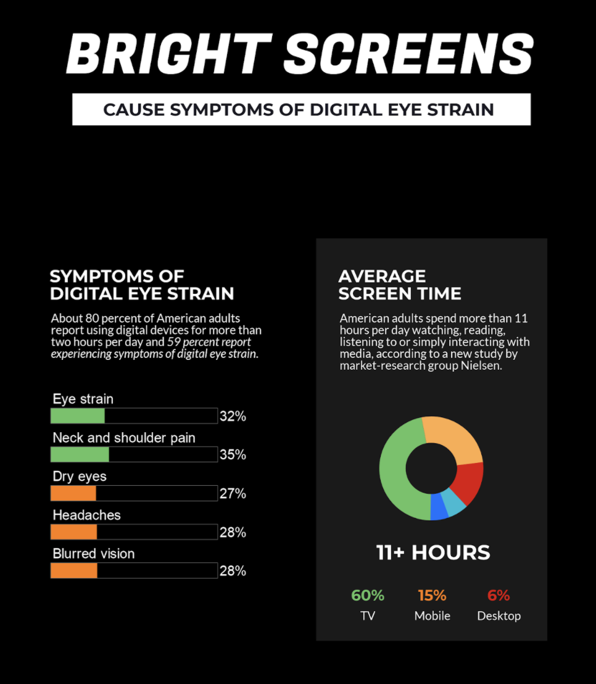

The Purdue study found that switching from light mode to dark mode at 100% brightness saves an average of 39%-47% battery power.

[Source](https://www.purdue.edu/newsroom/releases/2021/Q3/dark-mode-may-not-save-your-phones-battery-life-as-much-as-you-think,-but-there-are-a-few-silver-linings.html)

